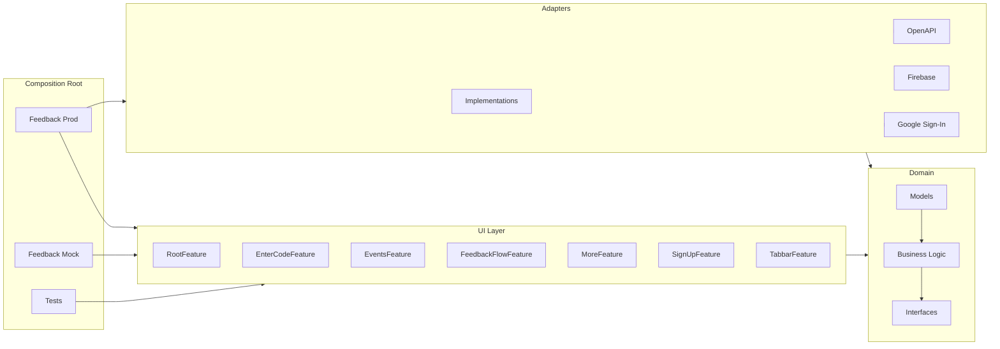

# Lets Grow: Feedback iOS App

This repository contains the source code for the **Lets Grow: Feedback** iOS app, available on the App Store.  
It is an open-source project built with [The Composable Architecture (TCA)](https://github.com/pointfreeco/swift-composable-architecture) and leverages iOS 26’s new **Liquid Glass** design system.

---

## 📸 Screenshots

  
  
  

  
  

---

## 🔧 Requirements
- Swift 6.2  
- Xcode 26  
- iOS 26  
- SwiftLint (`brew install swiftlint`)

---

## 🔌 API Layer

The API layer is fully generated from our [OpenAPI specification](https://github.com/FeedbackFriends/feedback-openapi).  
This ensures the client stays in sync with the backend contract.

---

## 🏗️ Architecture

The app follows a layered, **Clean Architecture–inspired** design.  
Each layer has a clear responsibility, with dependencies always pointing **inward** toward the Core.  
This separation makes the codebase easier to test, maintain, and evolve as new features or integrations are added.

### Layers

- **UI layer**: `RootFeature`, `EnterCodeFeature`, `FeedbackFlowFeature`, `EventsFeature`, `MoreFeature`, `TabbarFeature`, `SignUpFeature`  
  Feature modules that contain screens, state management, and user-facing logic, all built on TCA.  

- **Domain**: Models, data types, interfaces, and business logic contracts  
  Defines core rules and behaviors, completely independent of UI and third-party SDKs.  

- **Adapters**: `Implementations`, `OpenAPI`, `Firebase`, `Google Sign-In`  
  Bridge the Domain to external SDKs. These conform to Domain protocols so the UI and Core never depend directly on external code.  

- **Composition root**: `FeedbackProd` and `FeedbackMock`  
  Assemble the app by wiring Features to real or mock Adapters. This layer decides what runs in production versus testing.  

---

## 🐞 Issues & Feedback

If you run into problems, have questions, or notice something that isn’t working as expected,  
please [open an issue](../../issues) on this repository.  

We welcome bug reports, feature requests, and ideas that can help improve the app.  