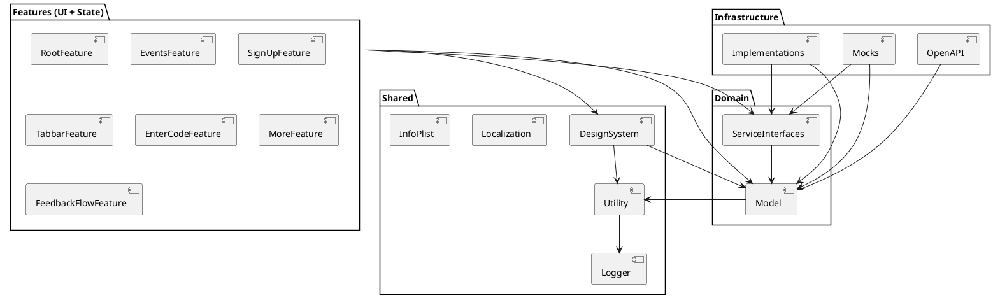

# Let's Grow iOS

Let's Grow iOS is a modular iOS application structured using the principles of onion architecture and designed with scalability, separation of concerns, and developer experience in mind.

---

## 🔧 Requirements

- Swift 5.8
- Xcode 16.4+
- SwiftLint (`brew install swiftlint`)

---

## 🧱 Architecture

The project embraces **Onion Architecture**, layered to enforce dependency direction and isolate concerns. This leads to a flexible, testable and decoupled codebase.



---

## 🗂️ Module Overview

### Features
- `RootFeature`, `EventsFeature`, etc: Use `@Reducer` and TCA to manage state and effects per screen.

### Domain
- `Model`: Pure types, data structures, and business logic.
- `ServiceInterfaces`: Protocol-like interfaces (e.g. `APIClient`) annotated with `@DependencyClient`.

### Infrastructure
- `Implementations`: Concrete Firebase, Google, and OpenAPI implementations.
- `Mocks`: Test and preview versions of `ServiceInterfaces` via `TestDependencyKey`.

### Shared
- `DesignSystem`: Fonts, colors, images, animations.
- `Utility`: Small helpers (e.g. date, UUID).
- `Logger`, `Localization`, `InfoPlist`: Core configuration.

---

## 🧪 Testing Strategy

- Uses `TestDependencyKey` and `ComposableArchitecture` test helpers.
- `Mocks` module defines `previewValue` and `testValue` for all services.
- Snapshots via `swift-snapshot-testing`.

---

## ✅ Why It Works

- No feature depends on infrastructure.
- Interface-driven design: features use protocols, not implementations.
- Mocks + previews live outside production code.
- PlantUML diagrams document structure.
- SPM enables full modular build and caching.

---

## 📦 Getting Started

```bash
brew install swiftlint
open Feedback.xcodeproj
```

> Don't forget to run `swiftlint` as part of your pre-commit hook or CI pipeline.
