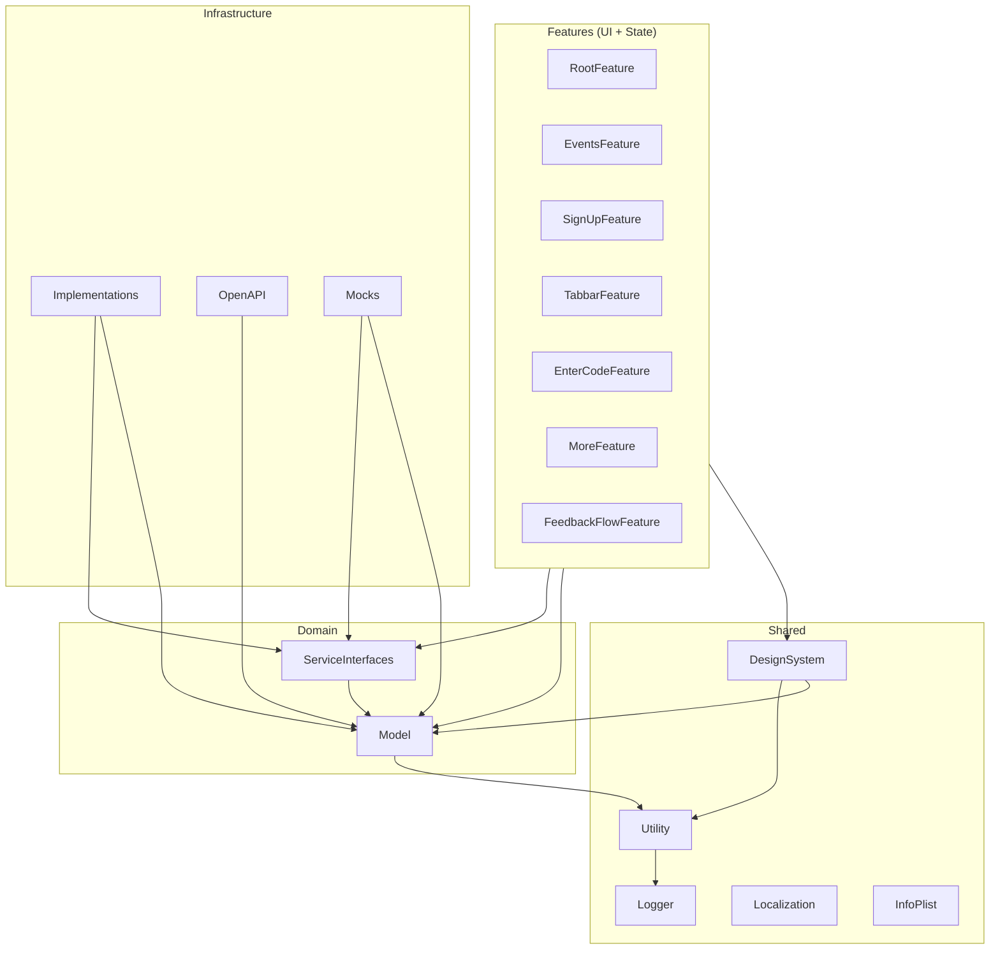

# 'Lets Grow: Feedback' iOS app 💥

[](https://github.com/FeedbackFriends/feedback-openapi/blob/main/openapi.yaml)
[](https://kotlinlang.org)
[](https://spring.io/projects/spring-boot)

This repo contains the codebase for the 'Lets Grow: Feedback' iOS app, a A modern, beautiful iOS app built with SwiftUI, Composble Architecture and the latest iOS 26 SDK features.

. An app that enables you whether you're leading meetings or improving personal skills to get the feedback you need.

Available on the App Store soon!

---

## 🔧 Requirements
- Swift 6.2
- Xcode 26+
- iOS 26
- SwiftLint (`brew install swiftlint`)

---

## 🧱 Architecture

The project embraces modularization of features and layered to enforce dependency direction and isolate concerns. This leads to a flexible, testable and decoupled codebase.



---

## 🗂️ Module Overview

### Features
- `RootFeature`, `EventsFeature`, etc: Use `@Reducer` and TCA to manage state and effects per screen.

### Domain
- `Model`: Pure types, data structures, and business logic.
- `ServiceInterfaces`: Protocol-like interfaces (e.g. `APIClient`) annotated with `@DependencyClient`.

### Infrastructure
- `Implementations`: Concrete Firebase, Google, and OpenAPI implementations.
- `Mocks`: Test and preview versions of `ServiceInterfaces` via `TestDependencyKey`.

### Shared
- `DesignSystem`: Fonts, colors, images, animations.
- `Utility`: Small helpers (e.g. date, UUID).
- `Logger`, `Localization`, `InfoPlist`: Core configuration.

---

## 🧪 Testing Strategy

- Uses `TestDependencyKey` and `ComposableArchitecture` test helpers.
- `Mocks` module defines `previewValue` and `testValue` for all services.
- Snapshots via `swift-snapshot-testing`.

---

## ✅ Why It Works

- No feature depends on infrastructure.
- Interface-driven design: features use protocols, not implementations.
- Mocks + previews live outside production code.
- PlantUML diagrams document structure.
- SPM enables full modular build and caching.

---

## 📦 Getting Started

```bash
brew install swiftlint
open Feedback.xcodeproj
```

> Don't forget to run `swiftlint` as part of your pre-commit hook or CI pipeline.
